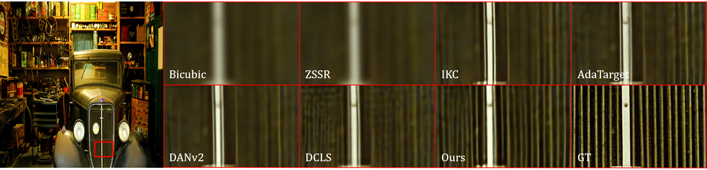
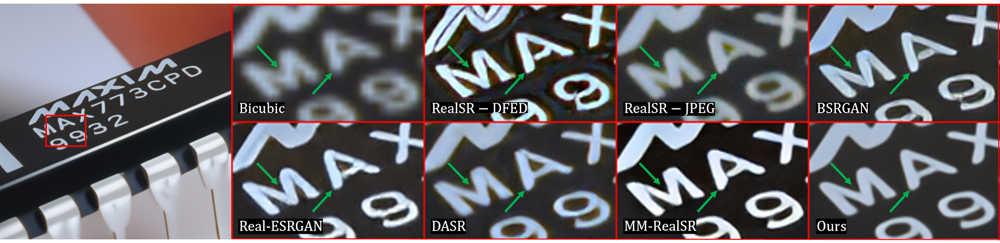
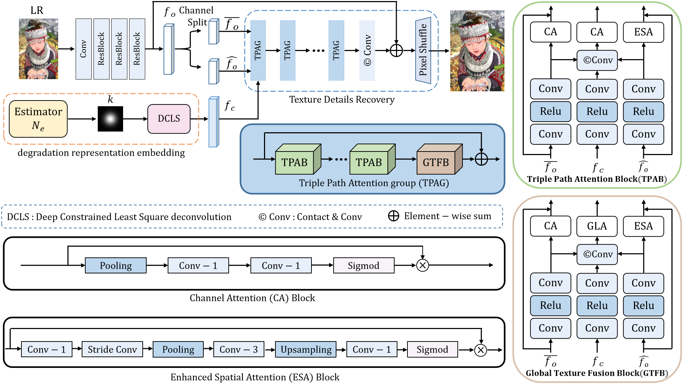
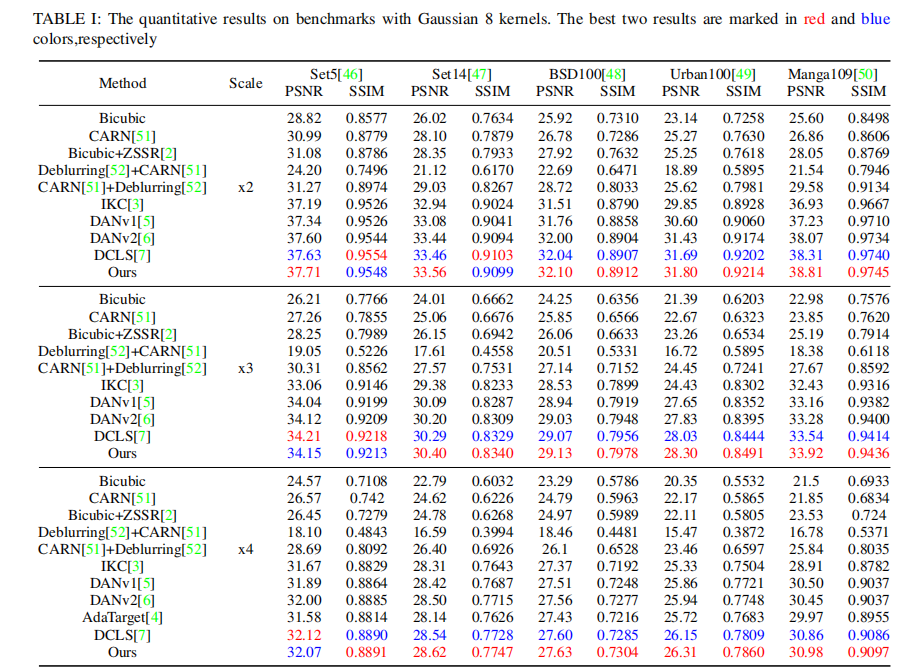
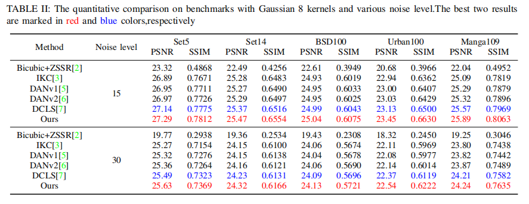

## [KESPKSR] A Blind Image Super-resolution Network Combined Kernel Estimation and Structural Prior Knowledge

<h4 align="center">Jiajun Zhang<sup>1</sup>, Yuanbo Zhou<sup>1</sup>, Yuyang Xue<sup>2</sup>, Wei Deng<sup>3</sup>, Qinquan Gao0<sup>1</sup>, Tong Tong<sup>1</sup></center>
<h4 align="center">1. Fuzhou University, 2. University of Edinburgh</center> 3. Imperial Vision Techonology</center>


#### This is the official implementation of 'KESPKSR: A Blind Image Super-resolution Network Combined Kernel Estimation and Structural Prior'.


### Updates


We released the code and provided the **pretrained model weights** [[here]](https://pan.baidu.com/s/1YchpbBqK6PkLR5Ghyht1Cw). Password: KESP





## Overview



## Dependenices

* OS: Ubuntu 18.04
* nvidia :
    - cuda: 10.1
    - cudnn: 7.6.1
* python3
* pytorch >= 1.6 
  * (we recommend use pytorch 1.7.1)
* Python packages: numpy opencv-python lmdb pyyaml


## Dataset Preparation
1: Training data

We use DIV2K and Flickr2K as our training datasets (totally 3450 images). 

To transform datasets to binary files for efficient IO, run:

```bash
python3 codes/scripts/create_lmdb.py
```

2: For evaluation of Isotropic Gaussian kernels (Gaussian8), we use five datasets, i.e., Set5, Set14, Urban100, BSD100 and Manga109.

To generate LRblur/LR/HR/Bicubic datasets paths, run:

```bash
python3 codes/scripts/generate_mod_blur_LR_bic.py
```

3: For evaluation of Anisotropic Gaussian kernels, we use DIV2KRK.

(You need to modify the file paths by yourself.)

## Train
1. The core algorithm is in ``codes/config/KESPKSR``. 
2. Please modify `` codes/config/KESPKSR/options `` to set path, iterations, and other parameters...
3. To train the model(s) in the paper, run below commands.

For single GPU:

```bash
cd codes/config/KESPKSR
python3 train.py -opt=options/setting1/test/train_setting1_x4.yml
```

For distributed training

```bash
cd codes/config/KESPKSR
python3 -m torch.distributed.launch --nproc_per_node=4 --master_poer=4321 train.py -opt=options/setting1/train/train_setting1_x4.yml --launcher pytorch
```
Or choose training options use

```
cd codes/config/KESPKSR
sh demo.sh
```

## Evaluation
To evalute our method, please modify the benchmark path and model path and run

```bash
cd codes/config/KESPKSR
python3 test.py -opt=options/setting1/test/test_setting1_x4.yml
```


Specifically, for x2_setting2: we use subimage to inference to avolid cuda out of memory.
```bash
cd codes/config/KESPKSR
python3 test_subimg.py -opt=options/setting1/test/test_setting1_x4.yml
```
## Results

#### Comparison on Isotropic Gaussian kernels (Gaussian8)


#### Comparison on Isotropic Gaussian kernels (Gaussian8) with noise level


#### Comparison on Anisotropic Gaussian kernels (DIV2KRK)


## Contact
email: [211127180@fzu.edu.cn], [webbozhou@gmail.com] 

## Acknowledgement
This project is based on [[DCLS](https://github.com/megvii-research/DCLS-SR)], [[DAN](https://github.com/greatlog/DAN)][[DAN](https://github.com/greatlog/DAN)], [[MMSR](https://github.com/open-mmlab/mmediting)] and [[BasicSR](https://github.com/xinntao/BasicSR)].
